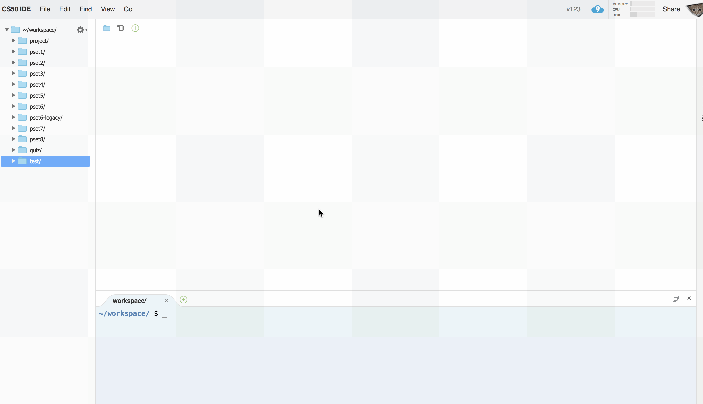
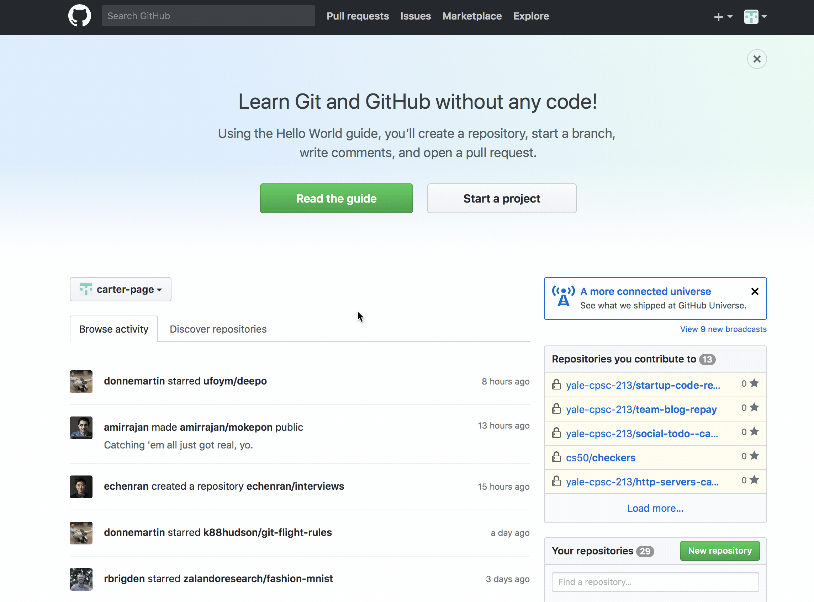
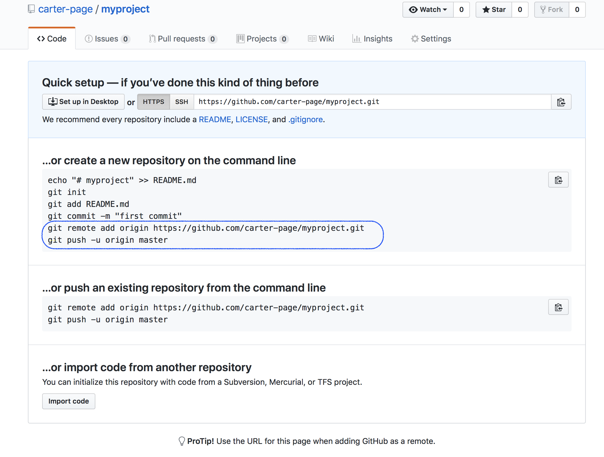
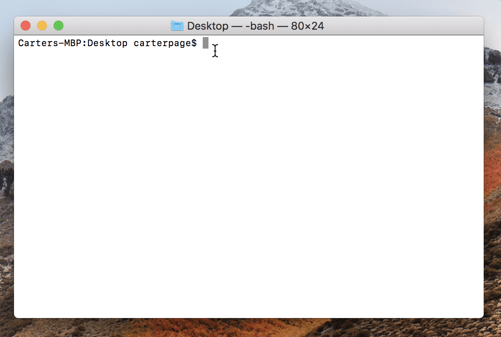
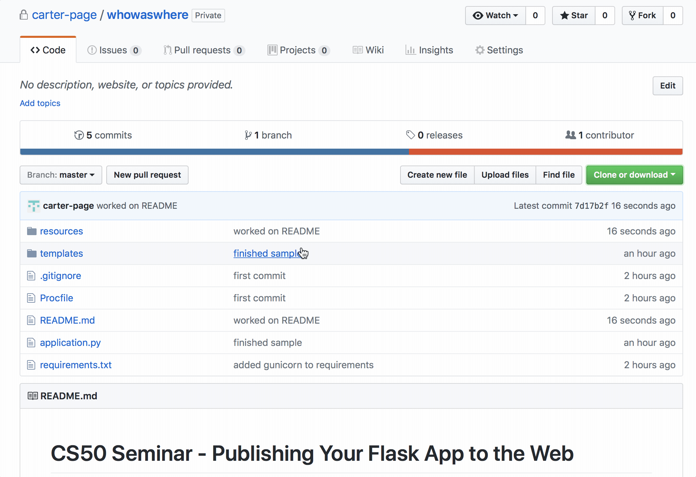
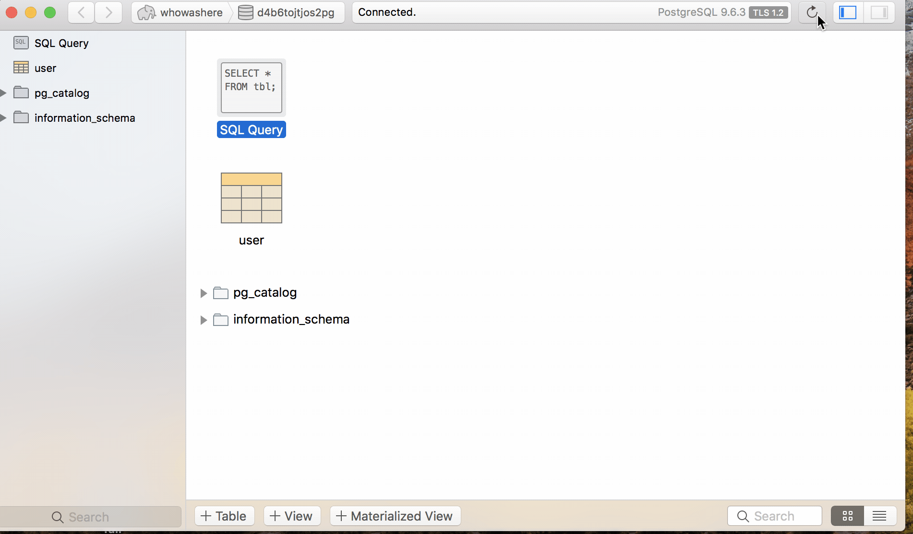
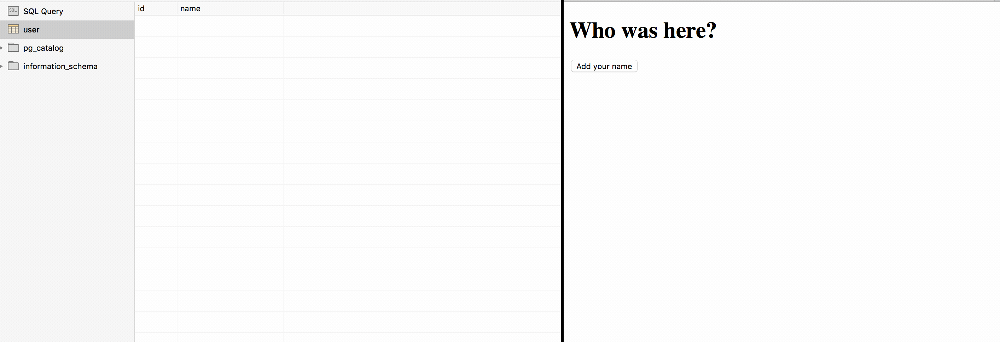

# CS50 Seminar - Publishing Your Flask App to the Web

## Carter Page
### November 8, 2017

---

### Plan of Attack
In this seminar, we divide publishing your Flask App to the Web into five parts.

1. From CS50 IDE to GitHub
2. From GitHub to Your Mac
3. Database "Tire Change"
4. From Your Mac to Heroku
5. From Heroku to the Web

You can also follow along at https://github.com/carter-page/whowashere.

Let's get started!

---

## Part I - From CS50 IDE to GitHub

---

### CS50 IDE
To begin, log into your CS50 IDE and `cd` into your project directory. We are going to start off by getting our Flask app out of the CS50 IDE. To do so, we are going to upload the files to the website GitHub using `git`.

---

```bash
cd ~/project
git init
git add .
git commit -m "first commit"
```




---

Next, log into your GitHub accound and create a new repository.



---

```bash
git remote add origin [URL]
git push -u origin master
```


---

## Part II - From Github to Your Mac

---


---

### Homebrew

To prepare your Mac for your Flask app, we need to download many different tools known as packages that our flask app needs to run. To keep track of and manage all of these packages, we will use an incredible program called Homebrew that is a lifesaver.

You can learn more about Homebrew at [Homebrew's website](https://brew.sh).

---

To install Homebrew, copy and paste the following into your Terminal and press enter.



---

Now that we have Homebrew, let's get `git` and download the files that we previously pushed up to GitHub.

```bash
brew install git
```
---

```bash
cd ~/Desktop
git clone [URL]
```



---

You can download the sample `whowashere` app by running:

```bash
git clone https://github.com/carter-page/whowashere.git
```


---

For our flask app, use brew to install `python` and `python3`.

```bash
brew install python
brew install python3
```

Keeping track of all the dependencies of our specific flask app is quite a lot of work. To make that easier we are going to use virtual environments.

```bash
brew install virtualenv
```

---

### Atom

In the CS50 IDE, if you wanted to edit a file, you just clicked on it. It's not so simple on your Mac. Developers use different text editors to interact and make changes to programs. For this walkthrough, I recommend using Atom. You can download Atom at https://atom.io

---

Once you have Atom installed, you can take a look at the files in your flask app by executing `atom .` which means open the current directory in Atom. Atom should immediately remind you of the CS50 IDE.

```bash
cd ~/Desktop/whowashere
atom .
```

---

### Create our Virtual Environment

Next, create a virtual environment that uses `python3` by default.

```bash
cd ~/Desktop/whowashere
virtualenv -p python3 venv
```
---
To turn on our virtual environment that we have named `venv`, activate it and then use `pip` to install the requirements listed in `requirements.txt`.
```bash
source venv/bin/activate
pip install -r requirements.txt
```
---

## Part III - Database "Tire Change"

---

If you tried running `flask run` in the Terminal, it wouldn't work. This because the code I have provided is not connected to any database. Right now, the program is trying to connect to a `DATABASE_URL`, but we have not defined what that url is.

---

```python
app.config['SQLALCHEMY_DATABASE_URI'] = os.environ['DATABASE_URL']`
```
We will get this `DATABASE_URL` from Heroku Postgres.

---

### Heroku

Heroku is a platform that makes it easy for developers to publish their web applications. To download Heroku's command-line tools, exectute the following in your Terminal.

```bash
brew install heroku/brew/heroku
```

Next, create a Heroku account if you do not already have one at https://signup.heroku.com

Once you have an account, execute
```bash
heroku login
cd ~/whowashere
heroku create
```
---

### Procfile

Heroku needs something called a `Procfile` to tell Heroku what command needs to be executed to get your web app to run. This has been provided for you in the `whowashere` repository, but you will have to do this on your own.

**It is very easy to forget to add a Procfile! If Heroku gives you error messages, always first double check you have given Heroku a Procfile.**

```bash
pip install gunicorn
touch Procfile
web: gunicorn application:app
```
---

### Switch out our SQLite for PostgreSQL
**The most difficult part of journey is switching out the SQLite we used in the CS50 IDE for Heroku Postgres.** 

This step will take time and learning more about [Flask-SQLAlchemy](http://flask-sqlalchemy.pocoo.org/2.3/quickstart/) to find the answers for your specific database implementation.

---

Begin by
```
pip install Flask-SQLAlchemy
```
We now need to remove the following lines from our code that invoke SQLite since we are switching to Heroku Postgres.
```python
# Remove
from cs50 import SQL
...
db = SQL("sqlite:///finance.db")
```
---

```python
#Replace with

import os
from flask_sqlalchemy import SQLAlchemy

app = Flask(__name__)
app.config['SQLALCHEMY_TRACK_MODIFICATIONS'] = False

app.config['SQLALCHEMY_DATABASE_URI'] = os.environ['DATABASE_URL']
db = SQLAlchemy(app)

class User(db.Model):
    id = db.Column(db.Integer, primary_key=True)
    name = db.Column(db.String(80), unique=True, nullable=False)

    def __init__(self, name):
        self.name = name
```
---

```python
# Remove
db.execute("INSERT INTO user (name) VALUES (:name)", name=name)

# Replace with
new_user = User(name)
db.session.add(new_user)
db.session.commit()
```
---

Similarly, We can implement a `SELECT` statement by using `query` following the class name.

```python
users = User.query.order_by(User.id).all()
```
Once we have switched to Flask-SQLAlchemy, all we need to do now is create our database.

---

### Getting our Heroku Postgresql `DATABASE_URL`

We generate our Heroku Postgres `DATABASE_URL` using the following commands.

```bash
heroku addons:create heroku-postgresql:hobby-dev
heroku config
```

The `config` command will output the `DATABASE_URL` environment variable. For local testing, copy this `DATABASE_URL` and then type `touch .env`. Inside of Atom, edit `.env` so that it is

```bash
export FLASK_APP=application.py
export FLASK_DEBUG=1

export DATABASE_URL=[DATABASE_URL]
```
To load these environment variables to your Mac, type

`source .env`

---

### Postico
Download the free trial of Postico at https://eggerapps.at/postico/

Open Postico, and with `DATABASE_URL` copied to your clipboard, click "New Favorite". The fields should be populated automatically. Click connect to connect to your database.

Right now, our database does not contain our `user` table. Time to create our table.

---

## Part IV - From Your Mac to Heroku

---

Use `git` to load, stamp, and send the files from your Mac to Heroku.
```bash
pip freeze > requirements.txt
git add .
git commit -m "pushing to heroku"
git push heroku master
```
---

### Actually Creating our Table

```
heroku run python
from application import db
db.create_all()
exit()
```
---

If you press refresh in the upper right hand corner of Postico, you should now see the `user` table appear.



---

### Running Locally
To run your web app locally, load your environment variables and then type flask run. **DON'T FORGET `source .env`.**
```
cd ~/Desktop/whowaswhere
source .env
flask run
```
Then on Safari or Chrome, go to `localhost:5000` and you should see your web app running.

---

## Part V - From Heroku to the Web

---

It has been a long journey. To see our flask app on the web, run

```
heroku open
```
and you should see your web app running on the internet. You can share the url with friends and family. Notice that if you add names to the web app (either locally or on the internet), the database updates in Postico.


---

# Thank you!

Be sure to check out https://github.com/carter-page/whowashere to download the demo `whowashere` code and follow along the full walkthrough. Good luck!


